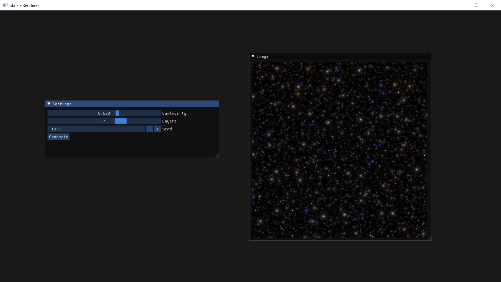

# starrrrrrrrrrs or star-rs

A Rust-based pet project for generating pseudo-random generated starscapes.

### Useful Links:

Followed this starfield tutorial to create custom star flare sprites:
https://www.youtube.com/watch?v=4DcsfIovlFM

glium Documentation:
https://docs.rs/glium/0.24.0/glium/index.html

imgui-rs documentation:
https://docs.rs/crate/imgui/0.8.2